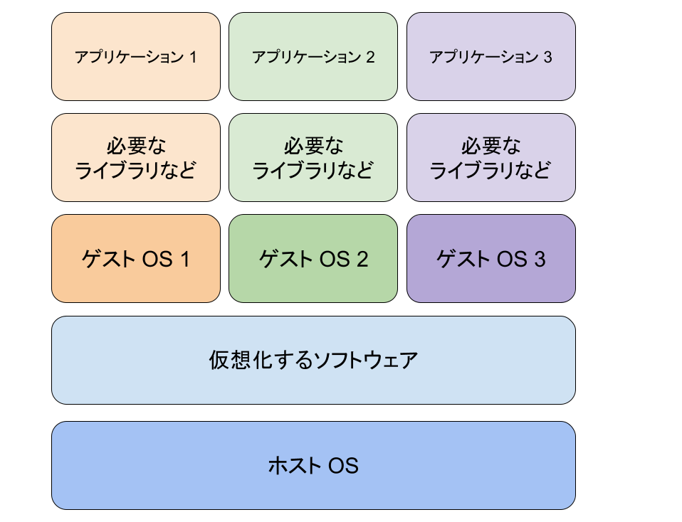
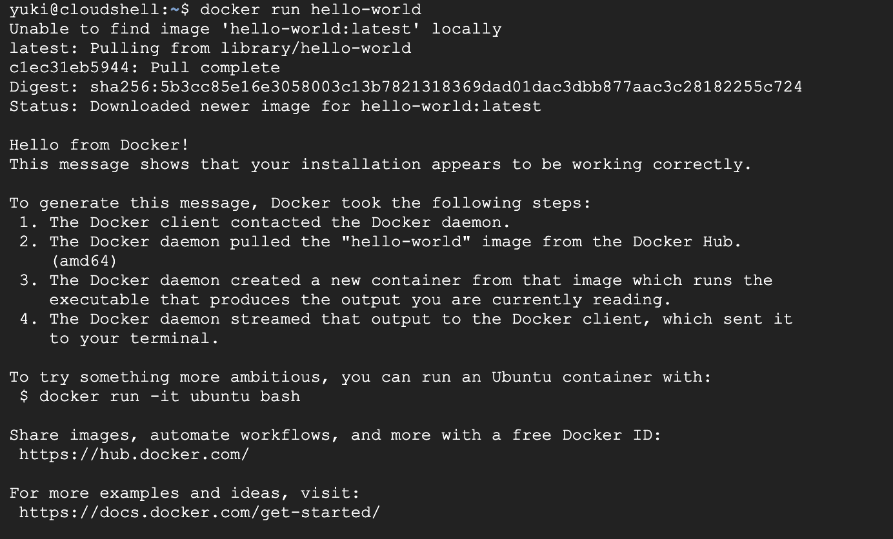

authors: Yuki
summary: Docker 入門ハンズオン
id: docker-ja
categories: Docker
environments: web
Feedback Link: https://github.com/Yu-HaruWolf/docker-codelab/issues

# Docker 入門ハンズオン

## 初めに
Duration: 0:02:00

このcodelabでは、Dockerについての基礎を学びます。
Dockerに関連する単語について解説し、実際に、イメージやコンテナを作成して動かしていきます。
このcodelabを通して、Dockerについて基本的な操作を1通り行うことができます。

### 前提条件

- インターネットに繋がるPC
- Google アカウント

## Dockerって何？
Duration: 0:05:00

DockerはDocker社が開発している仮想環境プラットフォームです。

### 仮想環境とは
仮想環境とは、1つのコンピュータ上で、別のコンピュータを動作させる環境です。
例えば、仮想環境を使えば、Windows上でLinuxのOSを仮想的に動作させることができます。
仮想環境を用意するOSをホストOS、仮想環境上で動いているOSのことをゲストOSと呼ぶことがあります。

また、仮想環境上で動作するゲストOSはホストOSから独立しているため、
ゲストOSで行った作業が、ホストOSや他の仮想環境に与える影響は少ないメリットもあります。
(ただし、CPUやメモリのリソースや、仮想環境プラットフォームの脆弱性を狙った攻撃に関しては、ホストOSにも大きな影響を与えます。)

仮想環境は、独立した環境であるため、複数の開発者で統一した開発環境を用意することにも役立ちます。
「仮想マシン」は、ホストOS上で、ゲストOSを完全にエミュレートします。
ゲストOSは独立したOSを持つため、ゲストOS自体を動作させるためにリソース消費が大きくなってしまう傾向があります。
仮想マシンのイメージ図はこんな感じです。



一方で、「コンテナ」は、アプリケーション実行に必要な最小限の環境のみを仮想化する方式です。
コンテナは、ホストOSのカーネル(根幹部分)を共有するため、ゲストOS自体を動作させるリソースが必要ない分、
仮想マシンよりもリソース消費が少なく済みます。

Dockerでは、コンテナ型の仮想環境を簡単に作成、管理することができます。

## Keywords
Duration: 0:05:00

実際に動かす前に、Dockerで重要なキーワードについて学びましょう。
### コンテナ(Container)
コンテナは、仮想環境での説明でも出てきましたが、
ここからは、アプリケーション実行に必要な最小限の機能を持った、独立した仮想環境のことを意味します。

### イメージ(Image)
イメージは、コンテナを作成するためのテンプレートです。
コンテナは基本的に作成時点で何らかの動作をすることになるので、
イメージの段階で、その動作のために必要な機能、変数や設定を定義しておきます。

## Hello, World
Duration: 0:10:00

とりあえずDockerを動かしてみましょう。
このcodelabでは、Google Cloud の Cloud Shell 上で実行を行います。
[https://shell.cloud.google.com/](https://shell.cloud.google.com/) にアクセスしましょう。

アクセスができたら、黒い画面上に次のコマンドを入力し、Enterで実行しましょう。
```
docker run hello-world
```

こんな感じのメッセージが表示されたら、正しく実行できています。


何をしたのか振り返っていきましょう。
`docker run`コマンドを使うと、指定したイメージを元にコンテナを作成し、実行します。
今回は`hello-world`というイメージを指定しました。

このイメージは、コンテナにして実行するとこんな感じの出力を出します。
```
Hello from Docker!
This message shows that your installation appears to be working correctly.

To generate this message, Docker took the following steps:
 1. The Docker client contacted the Docker daemon.
 2. The Docker daemon pulled the "hello-world" image from the Docker Hub.
    (amd64)
 3. The Docker daemon created a new container from that image which runs the
    executable that produces the output you are currently reading.
 4. The Docker daemon streamed that output to the Docker client, which sent it
    to your terminal.

To try something more ambitious, you can run an Ubuntu container with:
 $ docker run -it ubuntu bash

Share images, automate workflows, and more with a free Docker ID:
 https://hub.docker.com/

For more examples and ideas, visit:
 https://docs.docker.com/get-started/
```

このイメージは元々ローカルにあったわけではなく、[https://hub.docker.com/ (Docker Hub)](https://hub.docker.com)
にありました。
イメージのサイトが
[https://hub.docker.com/_/hello-world](https://hub.docker.com/_/hello-world)です。

Dockerでは、まず特に指定がなければ、ローカルに一致するイメージが存在しないか確認をし、ローカルにあれば
そのイメージを使って実行されます。
ローカルにない場合は、Docker Hubにアクセスし、イメージをダウンロードしてきます。

ちなみに、イメージをローカルにダウンロードしてくることをPullと言います。

## Web Server
Duration: 0:13:00
次は`httpd`というイメージを実行し、Web Serverを作っていきます。
次のコマンドで`httpd`イメージからコンテナを作成し、実行していきましょう。
```
docker run -p 8080:80 httpd
```
新しく`-p 8080:80`が増えています。これはポートと呼ばれるもので、
一般的にアクセスするアプリを特定するために使われます。
今回実行する`httpd`イメージでは、80番ポートで受付を行っています。
左の8080番ポートの8080という数値自体は習慣的につけられているものです。
他と被らない且つ利用できる範囲内であれば、他の数値でも基本的に大丈夫です。

コマンドが実行できたら、右上の「ウェブでプレビュー」ボタンから「ポート 8080 でプレビュー」をクリックします。
番号が8080でない場合は、「ポートを変更」から8080を指定してください。

新しいタブが開き、「It works!」と表示されれば、成功です！
簡易的なWeb Serverを作成することができました！

## Original Web Server
Duration: 0:13:00
先ほどはIt works!と表示されるページを返すWeb Serverを作ることができました。
ただ、これだとオリジナルの内容を表示させることができないので、次はオリジナルの内容を表示させられるようにしましょう。

次のコマンドを実行して、index.htmlを作成します。
```sh
cd /tmp
mkdir codelab-docker-httpd && cd codelab-docker-httpd
echo "Hello from Docker container!" > index.html
```

そして、今度は次のコマンドを実行してWeb Serverを作成します。
```sh
docker run -p 8080:80 -v /tmp/codelab-docker-httpd/:/usr/local/apache2/htdocs/ httpd
```
実行できたら、右上の「ウェブでプレビュー」ボタンから「ポート 8080 でプレビュー」で内容を確認してみましょう。

`Hello from Docker container!`或いは自分で書いた内容が表示されていればOKです。

先程のコマンドに今度は新しく`-v '/tmp/codelab-docker-httpd/:/usr/local/apache2/htdocs/'`が追加されました。
これは、ボリュームのマウントと呼ばれるアクションで、ホストOSにあるディレクトリをゲストOSと共有します。
このコマンドでは、ホストOSにある`/tmp/codelab-docker-httpd/`というディレクトリを
ゲストOSの`/usr/local/apache2/htdocs`というディレクトリで使えるようにしています。

これで、ゲストOSの内容の一部にホストOSの内容を一部加えることで、独立性をほとんど損なわずに、
ゲストOSのカスタマイズができるようになりました。

## Dockerfile
Duration: 0:10:00
ここまでは、既存のDocker イメージを使ってコンテナを作成しました。
次はオリジナルのイメージを作成するためにDockerfileについて触れていきましょう。

DockerfileはDockerのイメージを作成するために必要な情報を書き込んだテキストファイルです。
OSやインストールするソフトウェアや実行するコマンドなどを設定することができます。
実際に書く前に、いくつかインストラクションを紹介しておきます。(コマンドのような物です。)

### FROM
Dockerfileの中で1番最初に記述されるべき物です。
FROMでは、Docker イメージのベースを指定します。

Docker Hubで公開されているイメージの中には、
カスタマイズが前提で、最低限の機能しか入っていないイメージもあるので、
初めからカスタマイズしていきたい場合は、必要なOSのイメージを見つけると良いです。

### RUN
Docker イメージをビルドする時に、コマンドを実行するインストラクションです。

RUNに、ソフトウェアのインストールコマンドを渡しておけば、
Docker イメージにインストールしておきたいソフトウェアを追加することができます。

### COPY
Docker イメージに、ローカルにあるファイルやディレクトリをコピーして入れておくことができます。

コマンドを使って取得できないソフトウェアや新しく作成したファイルがあれば、
COPYを使って、Docker イメージに入れておくことができます。

### WORKDIR
作業ディレクトリを指定します。

コマンドによっては作業ディレクトリがどこであるかが重要な事があるので、
作業ディレクトリの指定が必要な場合や、作業ディレクトリを変更しておいた方が
コマンドが見やすくなる場合は積極的に使っていきましょう。

### CMD
Docker イメージをコンテナ化した後に、実行される時にデフォルトで実行されるコマンドです。

動かしたいアプリケーションを動作させるためのコマンドを入れておくと良いと思います。

## Let's write Dockerfile
Duration: 0:25:00
それでは早速Dockerfileを書いていきましょう。
今回は、既に用意されているWebアプリケーションを動かすためのDockerfileを書いていきましょう。

Webアプリケーションを準備するために、次のコマンドを実行してください。
```bash
cd
git clone https://github.com/docker/getting-started-app.git 
cd getting-started-app
```

`getting-started-app`のディレクトリ内で、`Dockerfile`を作成します。(ファイル名も`Dockerfile`です。)
Dockerfileの内容は次のようにしましょう。
```Dockerfile
FROM ubuntu:24.04
RUN apt-get update \
    && apt-get upgrade -y \
    && apt-get install -y --no-install-recommends \
    nodejs \ 
    npm \
    && rm -rf /var/lib/apt/lists/*
RUN npm install -g yarn
WORKDIR /app
COPY . .
RUN yarn install --production
CMD ["node", "src/index.js"]
EXPOSE 3000
```
前のページで説明していないインストラクションも出てきていますが、ひとまずビルドしてみましょう。
ビルドするには次のコマンドを実行します。

```bash
docker build -t getting-started .
```
ビルド中のログが適宜流れます。特にエラーが出てこなければ、ビルド成功です。
ビルドしたイメージは次のコマンドでコンテナ化して実行します。
```bash
docker run -d -p 8080:3000 getting-started
```
今回も、ウェブでプレビューで ポート 8080 でプレビューして、見てみましょう。

Todoアプリの画面が表示されたら成功です。

### 振り返り
Dockerfileを作成して実行することができたら、Dockerfileの内容を振り返りましょう。
1つずつ確認していきます。
```Dockerfile
FROM ubuntu:24.04
```
FROMのインストラクションは基となるイメージを指定する物でした。
今回はubuntuの24.04のイメージを指定しています。

```Dockerfile
RUN apt-get update \
    && apt-get upgrade -y \
    && apt-get install -y --no-install-recommends \
    nodejs \ 
    npm \
    && rm -rf /var/lib/apt/lists/*
RUN npm install -g yarn
```
RUNはDocker イメージをビルドする時に、コマンドを実行する物でした。
ここでは4つのコマンドを1つのインストラクションにまとめて実行しています。
Shellに関して補足をしておくと、バックスラッシュ(`\`)を書いておくと、コマンドの途中でも改行が入れることができます。
`&&`は、コマンド間を繋げる演算子で、前のコマンドが成功したら次のコマンドが実行されるというものになります。

ここでは、Ubuntuのパッケージ管理システムと`npm`を使って、
今回のWebアプリケーションの実行に必要なソフトウェアをインストールしています。

```Dockerfile
WORKDIR /app
```
WORKDIRは作業ディレクトリを指定する物でした。
今回は、`/app`を作業ディレクトリとして設定し、
Webアプリケーションもこのディレクトリに格納して、実行するようにしています。

```Dockerfile
COPY . .
```
COPYはホストOSにあるディレクトリやファイルをDocker イメージの中に入れる物でした。
今回は、ホストOSの作業ディレクトリを、Docker イメージの作業ディレクトリにコピーしていました。

```Dockerfile
RUN yarn install --production
```
今回のWebアプリケーションの実行に必要なソフトウェアをインストールしています。

```Dockerfile
CMD ["node", "src/index.js"]
```
CMDはDocker イメージをコンテナ化して実行した時にデフォルトで実行されるコマンドを指定する物でした。
今回はWebアプリケーションを実行するためのコマンドを指定しています。

```Dockerfile
EXPOSE 3000
```
EXPOSEはこのDocker イメージが使用するポート番号を指定する物です。
ただ、このインストラクションはこれだけではあまり大きな意味を持たず、
実行時にコマンドで指定をすることで意味を持ちます。
「このインストラクションさえ書いておけば外部からアクセスできるようになる」というわけではないんです。


## Next step
Duration: 0:05:00

以上で、Docker入門ハンズオンは終わりです。
今回はCloud Shell上で動かしてみましたが、手元で動かしたい場合は、こちらのリンクを参考にDockerを手元で用意できます。<br>
[https://docs.docker.com/get-started/get-docker/](https://docs.docker.com/get-started/get-docker/)

本日の内容を学ぶことで、「コンテナ型仮想環境」を作成することができるようになりました。
コンテナ型仮想環境を作成できるようになると、Google Cloud の Cloud Run等で、好きなコンテナを作成して、動かすことができるようになります。
Cloud RunはVirtual Machineとは違い、呼び出された時に、コンテナが立ち上がって実行されるので、待機時間中のコストを抑えることができます。
Cloud Runについて学びたい方はこちらのリンクをご覧ください。<br>
[https://www.cloudskillsboost.google/course_templates/741](https://www.cloudskillsboost.google/course_templates/741)